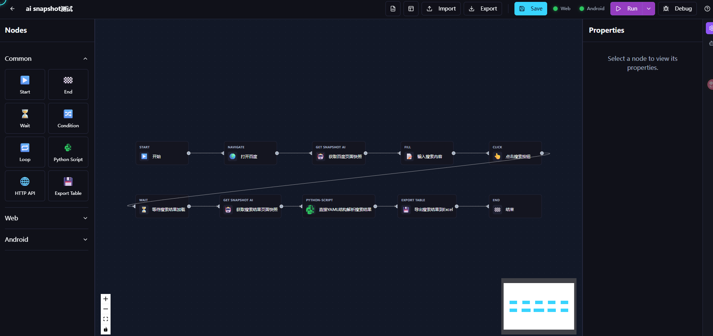
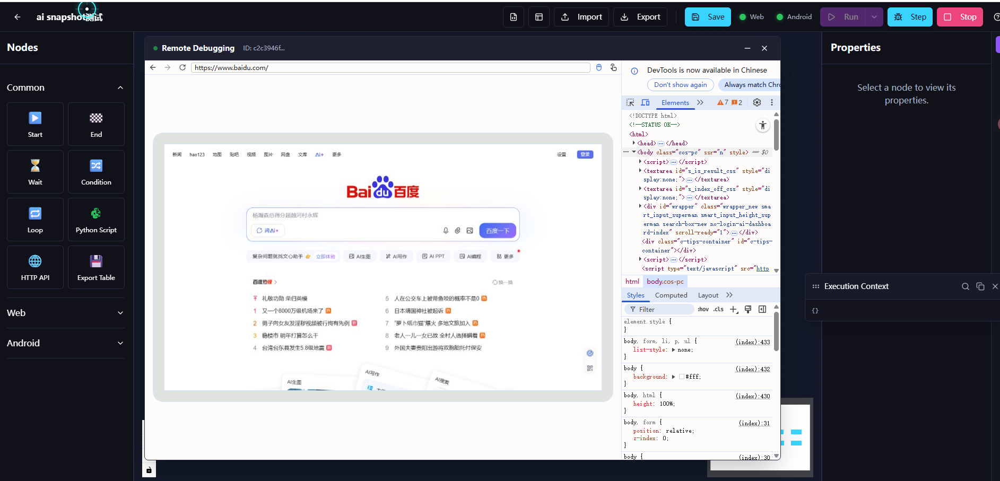
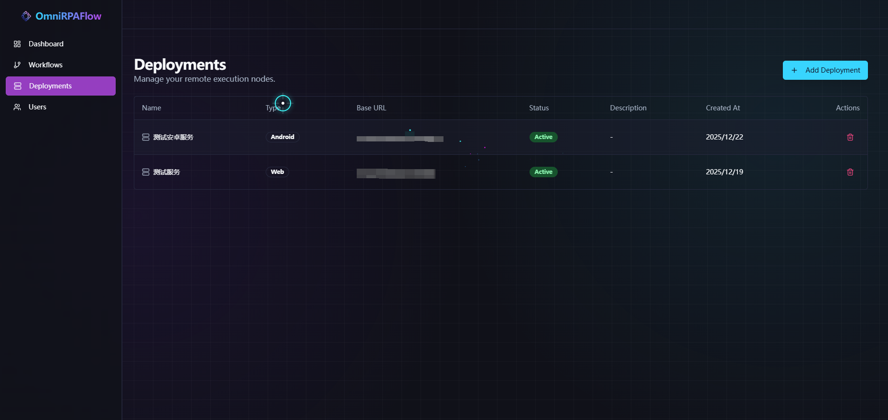
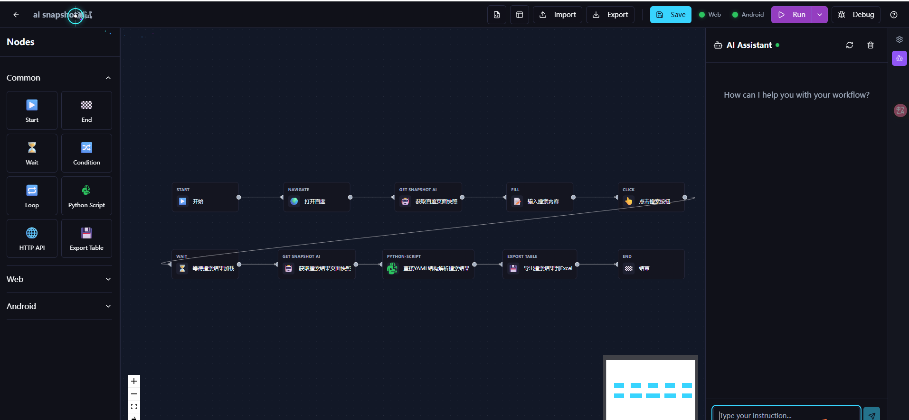

# OmniRPAFlow

OmniRPAFlow is an AI-powered multi-platform automation and spidering tool designed to simplify complex multi-platform interactions and data extraction tasks. It features a visual workflow editor, AI-driven node execution, and a robust backend for managing automation tasks.

## 🚀 Features

- **Visual Workflow Editor**: Drag-and-drop interface to build automation flows.
- **AI-Powered Nodes**: Leverage AI for intelligent element detection and decision making.
- **Cross-Platform**: Web-based interface with a local or deploy server for browser automation.
- **Extensible**: Modular node system allowing custom implementations.
- **Robust Backend**: Built with FastAPI and SQLAlchemy for performance and reliability.

## Examples
**AI Web Development:**
<video src="https://dragons96.github.io/OmniRPA/web_workflow.mp4" width="640" height="360" controls></video>

**AI Android Development:**
<video src="https://dragons96.github.io/OmniRPA/android_workflow.mp4" width="640" height="360" controls></video>

**Workflow Editor:**

**Web Debugger:**

**Android Debugger:**

**Deploy:**

**AI Support:**

The open source version will be launched in April 2026. If you are interested, please provide support from a star.
